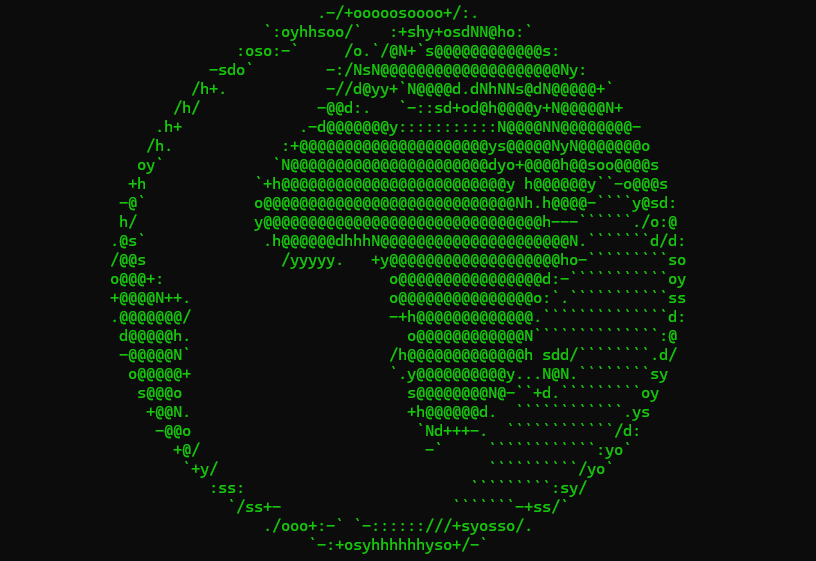
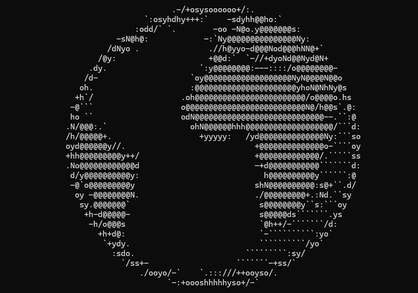

# 🌍 Earth ASCII Animation

A fun and simple **terminal-based ASCII Earth animation** that displays a rotating Earth using ASCII art. It runs directly in your **command prompt (Windows)** or **terminal (Linux/Mac)**.


## 📁 Project Files

| File Name | Description |
|------------|-------------|
| **EarthAnimation.py** | The main Python script. Runs the ASCII Earth animation using `os` and `time` modules. |
| **EarthAnimation.bat** | A Windows batch file that runs the Python script automatically when double-clicked. |
| **EarthAnimation.txt** | A text file containing the same ASCII animation code for reference or manual copy. |


## 🧠 How It Works

The animation cycles through multiple ASCII art frames representing the Earth. Each frame is printed in the terminal after clearing the previous one, creating a simple **rotating animation effect**.

Key points:
- Uses `os.system('cls' if os.name == 'nt' else 'clear')` to clear the screen cross-platform.
- Uses a loop with `time.sleep()` to control animation speed.
- Supports interruption with `Ctrl + C`.


## ⚙️ Requirements

- **Python 3.6+**
- Works on **Windows**, **macOS**, and **Linux**


## ▶️ How to Run

### **Option 1: Run via Python**
1. Open a terminal or command prompt in the project directory.
2. Run:

```bash
    python EarthAnimation.py
```
3. Press Ctrl + C anytime to stop the animation.

### **Option 2: Run via Batch File (Windows)**
Double-click `EarthAnimation.bat`

The batch file will automatically launch the animation in the console window.


## 🖼️ Screenshots

Here are some screenshots of the Earth Animation project:

**Earth Animation - `Windows Batch File`**<br/>


**Earth Animation - `Python File`**<br/>



## 🪄 Customization

You can modify:

- Animation speed: Change the delay parameter in **earth_animation(delay=0.5)**
- Frames: Add more ASCII art frames to earth_ascii for smoother rotation
- Display content: Replace ASCII frames with any other art or text-based scenes

## 💡 Tips

- If the animation looks misaligned, try resizing your terminal window.
- For slower or faster motion, adjust the delay value:

```bash
earth_animation(delay=0.3)  # faster
earth_animation(delay=1.0)  # slower
```


## Contributing

Contributions, suggestions, and feedback are always welcome! ❤️
To contribute:

1. Fork the repository
1. Create a new branch (`feature/new-feature`)
1. Commit your changes
1. Push and submit a Pull Request

💬 You can also open an issue if you’d like to discuss a feature or report a bug.


## For more or connect with me

<p align='center'>
  <a href="https://github.com/iamx-ariful-islam"></a>&nbsp;&nbsp;
  <a href="https://bd.linkedin.com/in/iamx-ariful-islam"></a>&nbsp;&nbsp;
  <a href="https://x.com/mx_ariful_islam"></a>&nbsp;&nbsp;
  <a href="https://www.facebook.com/iamx.ariful.islam/"></a>
</p>


## License

The [MIT](https://choosealicense.com/licenses/mit/) License (MIT)


## 💖 Thank You for Visiting!

> “Good design is about making things simple yet significant”  
> — *Md. Ariful Islam*